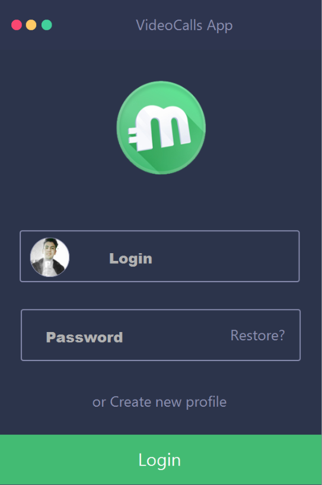
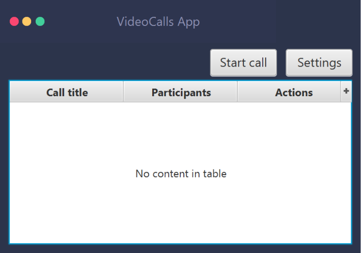
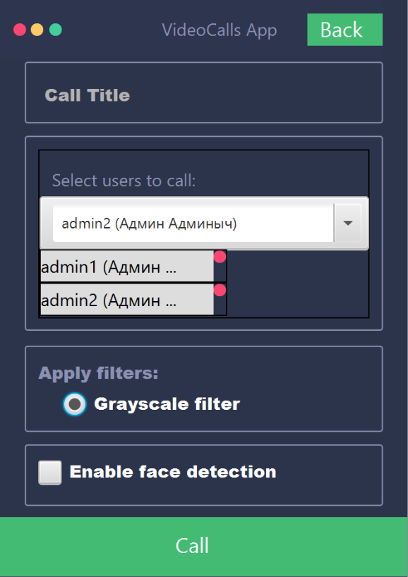
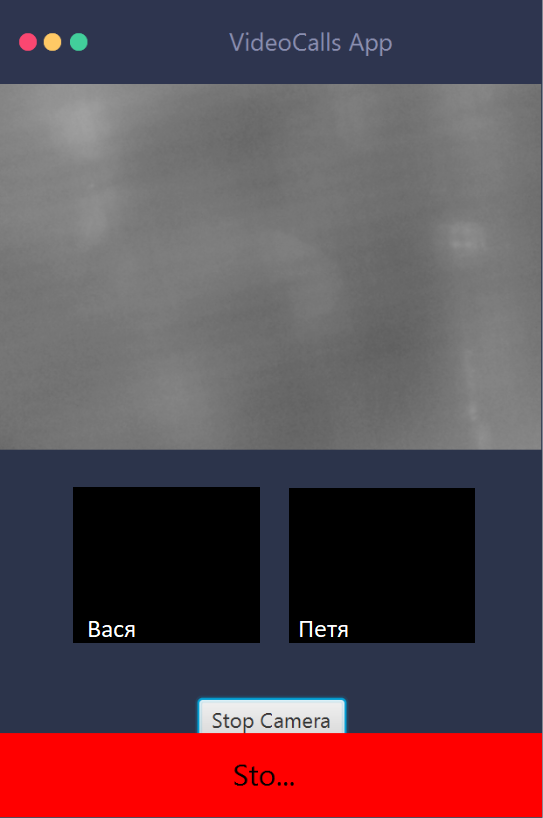

## Проектная работа по курсу Highload Architect (otus.ru): потоковый сервис видео-связи с постобработкой

Сервис состоит из серверного бекенда, десктопного приложения и мобильных клиентов (ios и android).

Десктопное клиентское приложение:
<table>
    <tr>
        <td></td>
        <td></td>
    </tr>
    <tr>
        <td></td>
        <td></td>
     </tr>
</table>

+ [Архитектура решения](#Architecture);
+ [Описание процесса установки](#Install);
+ [Полезные ресурсы](#Resources);

##  Архитектура решения:

Подробное описание архитектуры решения в [презентации](final_project_presentation.pdf).

**Воркфлоу обработки потока видео-данных звонка в сервисе:**

[клиентский фронтенд: javascript или javafx для простоты реализации. Инициализация звонка]

-> [сервис сбора данных из видео-потоков (от 1 до n): websocket, neety - java]

--> [буферизация данных, message sourcing в key-value db]

--> [apache kafka (+zookeeper) - отправка потоковых данных на обработку]

---> [сервисы обработки данных (от 1 до n): Storm, Spark или Ignite + OpenCV для ML - обработка данных (например, распознавание лица звонящего на видео)]

----> [оправка результатов обработки данных в kafka]

-----> [сервис доступа к данным (от 1 до n):  websocket, neety - java. предоставление обработанных данных клиентам.]

-------> [клиентский frontend: javascript или javafx для простоты реализации. Получение обработанных видео-данных от других участников звонка]

Верхнеуровневая архитектура:

Работа вычислителей, обрабатывающих фрейме видео-потока:

Внутреннее устройство сервисов обработки видео-потока:

##  Описание процесса установки:

Сервисы бекенда можно запускать в docker ([образы на docker-hub]()).

Для поднятия окружения следует воспользоваться docker-compose файлом [environment.yml](./environment.yml).

Клиентское приложение представляет собой исполняемый jar-файл (необходимо наличие установленной JRE 8)
на компьютере пользователя.

##  Версии:

### 1.0 MVP

+ регистрация/вход пользователей
+ создание групповых видео-звонков с возможностью распозвания лиц
+ доступен фильтр Гаусса для видео-потоков
+ просмотр списка звонков, в которых пользователь является участником
+ возможность участия в видео-звонке (одна активная сессия звонка в момент времени на пользователя)

### 1.1 [Planned]

+ передача аудио-потока от участников
+ окно настроек с возможностью выбора и калибровки камеры и микрофона
+ выделение текущего диктора в окне звонка

### 1.2 [Planned]

+ веб-клиент
+ мобильные клиенты
+ использование grpc вместо web socket

##  Полезные ресурсы: